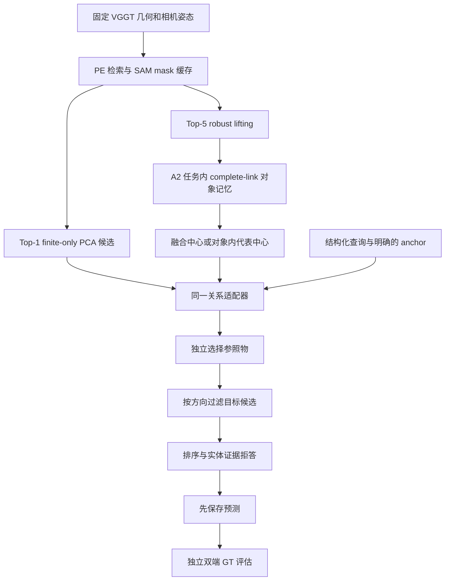

# 关系定位与拒答：模块、消融和面试讲法

本次实验于 2026-09-09～10 完成。结论是：**有可解释的小规模提升，但严格定位仍弱，尚不能声称实现了可靠的通用关系理解。** 本文中的新实验使用已经接触过的 Apartment/Cubicle，原主查询集保持冻结；它们属于事后开发和诊断，不是全新 held-out 结果。

- **系统比较：**相同关系适配器下，Cubicle 从 Top-1 PCA 候选的 **10/149** 严格正确，提高到 A2 融合候选的 **21/149**，再到代表中心版本的 **28/149**。负例误答从 0/149 增到 1/149；Apartment 为 1/136→1/136，且容差结果退步。
- **关系本身的贡献：**固定同一批 A2 融合候选，单独比较“先选物体再检查方向”与“先按方向筛选再选物体”，Cubicle 同类消歧补充集从 **0/10→3/10** 严格正确，容差为 5/10→9/10，负例误答均为 0/36。三项成功共享 textbooks 目标，不能解释成三个独立场景。
- **拒答的贡献：**固定 A2+PE 候选，实体匹配分数下限使 Cubicle 回答数 104→91，严格正确仍为 28，减少 13 个错误答案；覆盖率 34.90%→30.54%。这不是经过校准的正确概率。

完整数字见 [轻量证据](../evidence/relation-improvement/README.md)，历史简历口径见 [9 月 9 日审计](INTERVIEW_AUDIT_20260909.md)。

## 1. 问题定义与当前 pipeline

输入是结构化的 `(target, relation, reference, anchor_frame)`，例如 `(book, behind, waste bins, rgb_0)`。输出包括目标和参照物 ID、重建坐标下的中心、候选排序、证据帧、工程置信分数及拒答原因。没有自由自然语言解析器。



历史入口是 `relground/relations.py::RelationGrounder`；本次新增 `relground/relation_reasoning.py::PairRelationGrounder`，通过新实验入口调用。历史冻结关系模块的默认行为保留，不能把新实验结果误认为旧入口已经自动更新。

所有关系都在指定 anchor 下计算。设 anchor 的旋转为 `R`，目标与参照物中心为 `c_t, c_r`：

```text
Δ = Rᵀ(c_t − c_r)
left_of: −Δx       right_of: +Δx
front_of: +Δz      behind:   −Δz
```

四种关系的有符号距离必须大于 `0.10` 才兼容；单位是 **VGGT 重建坐标单位，不是厘米或米**。当前方向约定是 anchor `+x` 向右、`+z` 向前；它表示相对 anchor 的方位，不表示参照物自身的朝向。OBB 的朝向和尺寸不直接参与这个方向公式。

评估才使用 Sim(3) 将预测中心变换到 Clio 坐标，严格正确要求 **target 和实际使用的 reference 中心均落入各自的 GT OBB**。这里没有评估整盒 IoU，也不是 Clio 官方检测指标。

## 2. 为什么单物体查询能成功，关系定位却弱

首先，两个查询不是同一个判定条件。一个目标中心正确就能通过单物体定位；关系定位还需要参照物正确。历史 Cubicle 单物体 Q1F 是 7/18，而原关系 A2 候选中 7 类可严格定位，最多提供 21 个严格正确的任务对；原关系模块答对其中 17 个，另外 4 个因候选歧义拒答。149 个正例的组合分母会放大单物体的缺失和偏差。

其次，两条路径也有差异：单物体 Q1F 有 Q0 fallback，旧关系 memory 只装入永久 A2 对象。Apartment 的 alarm clock 可以由 fallback 找到，却没有进入这份关系 memory，不能直接用单物体成功数推导关系可用性。

最后，“融合 OBB”不是精确三维表面融合。`association.py::_fuse` 的中心是观测质量加权平均，包围盒是观测盒角点的轴对齐外包。受遮挡、混入背景、错误深度或错误关联影响，平均中心可能落到物体外；盒子变大不保证定位点变准。

对方向误差，设两端误差为 `e_t, e_r`，则方向偏差来自 `Rᵀ(e_t−e_r)`。接近关系边界时可能翻转 left/right；物体很小、任务间距较大时，也可能**方向没变，但中心已经越出 GT OBB**。当前数据主要暴露后一种问题。

新版本 Cubicle 的 103 个正例已选到双端候选，其中：双端严格正确 28、仅 target 错 43、仅 reference 错 12、双端都错 20。另有 46 个正例根本缺 target/reference 候选。不能把所有失败都归到关系比较公式。

## 3. 公平 baseline 与实验边界

上游源码范围固定在 `35327ac28b7d193df9ccc39ba6346052bb6f1207`，参考 [VGGT-SLAM 上游](https://github.com/MIT-SPARK/VGGT-SLAM/tree/35327ac28b7d193df9ccc39ba6346052bb6f1207)。它提供 PE 最佳帧检索、SAM 开放集分割和点云 PCA OBB；在所检查的入口中没有本项目这种关系评测系统。

因此 baseline 的准确名称是：**“VGGT-SLAM 式 Top-1 对象候选 + 统一关系适配器”**。不能说“官方关系准确率 10/149”。

| 控制项 | 做法 |
|---|---|
| 几何、PE 检索与 SAM | 复用同一冻结缓存；Top-1 帧必须等于 PE upstream Top-1；相同 SAM 名词提示、0.50 阈值、相同像素网格 |
| baseline lifting | Top-1 的所有 mask 做 finite-only 齐次变换和 PCA，包括被 robust 路径丢弃的 mask；与本地上游实际 PCA 函数核对中心和尺寸 |
| prompt 边界 | 两侧共享已有 task→SAM 名词映射；不是完整逐字照搬上游的端到端 prompt 流程 |
| 关系适配器 | 每种候选池均运行全部 5 种推理/拒答策略，共 6×5=30 个配置 |
| 候选分数 | 统一使用最高单次观测质量，避免某一侧仅因观测更多而置信度膨胀 |
| 预算 | 每场景 18 个 task；Top-1 18 次、Top-5 90 次 SAM 调用的缓存。一个关系通常涉及两个 task，跨查询可复用；不是相同计算预算 |
| GT 使用 | 候选构建和 grounder 不读 GT/Sim(3)。GT 用于出题和独立评估；原主查询已冻结，补充查询由公开规则生成后再预测 |

预测来自已有 PE/SAM/几何缓存，本次重放不用 GPU；不能把 CPU 重放耗时当成完整系统端到端延迟。PE 代表中心分数也复用此前已算好的 crop embedding 缓存。

## 4. 三处小改动

### 4.1 将对象内代表中心推广到关系候选

不改 A2 聚类、不重选 task、不读 GT，只为每个已有永久对象构造几种定位点：

| 候选池 | 定位点 |
|---|---|
| `top1_pca` | 上游式单帧 finite-only PCA 中心 |
| `top1_robust` | 同一 Top-1 帧的 robust lifting 中心 |
| `a2_fused` | 原 A2 质量加权融合中心 |
| `a2_quality` | 对象内最高 observation quality 的观测中心 |
| `a2_medoid` | 对象内到其他观测中心距离之和最小的实际观测中心 |
| `a2_pe` | 对象内 PE mask-crop 与 task 相似度最高的观测中心 |

medoid 的动机是避免平均出一个没有实际观测支持的中心；PE 的动机是减少语义不纯观测对位置的影响。**PE 没有参与关联，也没有训练新的 embedding。** 最终严格结果中 medoid 与 PE 在 Cubicle 打平，不能把 28/149 全归功于语义模型。

每个代表中心候选仍保留原融合 OBB 及全部观测用于追溯；本次改变的是定位点，不是重拟合整个包围盒。最终关系策略只用中心；OBB 重叠仅参与已弃用的分组分差拒答消融。

### 4.2 固定参照物，并让关系参与目标选择

实体分数为 `s(q,o) = Jaccard(q, label(o)) × max_observation_quality(o)`，分词与原项目一致。

先按实体分数独立选 reference，避免系统为了满足 left/right 随查询方向更换参照物；随后按当前关系的有符号距离过滤 target，再在剩余候选中按实体分数排序。没有兼容目标就拒答。

这比“先选最高分 target，然后发现方向不符就拒答”多了真正的候选消歧能力。固定参照物也有代价：第一名 reference 若选错，关系筛选无法自行纠正；没有声称解决多参照物联合推理。

### 4.3 使用可解释的实体证据拒答，保留失败消融

观测质量为检索分数、SAM 分数和有效点比例的几何平均。对象分数取最大单次质量；pair 分数取两端实体分数最小值，避免旧 `1−∏(1−q)` 因重复相关观测不断接近 1。

最终 `filter_with_entity_guard` 在缺少实体、两端任一实体分数低于 `0.25`、或没有方向兼容目标时拒答。分数不是概率，没有训练或验证概率校准器。

`filter_with_abstention` 是失败消融：还会将空间邻近且盒重叠的候选做 complete-link 分组，并在 top-2 组分差小于 `0.05` 时拒答。它会将同一粗粒度 GT 内的多个合理候选误判为不可回答，因此没有用于最终策略。

五种模式均保留：

| 模式 | 行为 |
|---|---|
| `no_relation` | 按实体分数选双端，不以方向或分数下限拒答；仍要求候选及合法 anchor 存在 |
| `check_after_selection` | 先选双端，再检查方向 |
| `filter_before_selection` | 固定 reference，先过滤 target 再排序 |
| `filter_with_entity_guard` | 上一项加双端实体分数下限；最终策略 |
| `filter_with_abstention` | 上一项再加候选组分差拒答；失败消融 |

v2 是看过 v1 的过度拒答结果后确定的策略修订；没有数值阈值网格搜索，但也不能因此声称策略选择独立于测试数据。

## 5. 统一指标与主查询集

主集保持原来的全部查询：Apartment 136 正例＋136 反向负例；Cubicle 149＋149。由单 GT task 两两组合生成，选择 anchor x/z 中位移较大的轴，GT 轴间距至少 0.25 m。背景缺失、关联失败都留在分母内。

- **严格正例准确率：**回答且双端中心命中各自 GT OBB / 全部正例。
- **容差敏感性：**GT OBB 半径增加场景 Sim(3) 配准 RMSE，Apartment 约 13.63 cm、Cubicle 约 2.99 cm。不能作为严格准确率或置信区间。
- **负例误答：**回答的负例 / 全部负例；正例拒答另行统计。
- **coverage：**全部输出答案 / 全部查询；**risk：**输出的错误答案 / 全部输出答案。无回答时 risk 为 null。
- **双端正确的几何拒答：**负例中，已选双端定位正确且因关系冲突拒答。它用于区分“定位成功后拒答”和“没找到物体导致拒答”。

以下候选消融全部使用相同最终适配器：

| 候选池 | Apartment 严格 / 容差正例正确（/136） | Apartment 负例误答（/136） | Cubicle 严格 / 容差正例正确（/149） | Cubicle 负例误答（/149） |
|---|---:|---:|---:|---:|
| Top-1 PCA | 1 / 45 | 1 | 10 / 45 | 0 |
| Top-1 robust | 1 / 45 | 1 | 10 / 45 | 1 |
| A2 fused | 0 / 28 | 0 | 21 / 77 | 1 |
| A2 quality | 1 / 28 | 1 | 21 / 66 | 1 |
| A2 medoid | 0 / 21 | 0 | 28 / 66 | 1 |
| A2 PE | 1 / 28 | 1 | 28 / 78 | 1 |

Cubicle 10/149=6.71%→28/149=18.79%，差值 **12.08 个百分点**。主查询上，换成双方相同的 `check_after_selection`，也仍是 10→28，负例误答均为 0。说明主集的新增严格正确主要来自候选定位，而不是关系筛选本身。

贡献不能只按净差值讲：Top-1→A2 fused 有 **15 个新增成功、4 个退步**，净增 11；A2 fused→PE 有 **7 个新增、0 个退步**，这 7 个全都共享被修正的 **tape measure 参照物**。这不是 18 次独立推理改进。

Apartment 虽然最终仍为 1，但成功任务对发生替换：丢失 toaster–alarm clock，新增 toaster–pile of clothes。更不能称为“原有成功全保留”。

### left/right 等方向分解

这里按查询请求的方向分组；负例方向与其正例相反。表中只列严格正例：

| 场景与候选 | left_of | right_of | front_of | behind |
|---|---:|---:|---:|---:|
| Cubicle Top-1 PCA | 3/14 | 3/20 | 2/52 | 2/63 |
| Cubicle A2 fused | 5/14 | 4/20 | 7/52 | 5/63 |
| Cubicle A2 medoid / PE | 5/14 | 7/20 | 9/52 | 7/63 |
| Apartment Top-1 PCA / A2 PE | 1/44 | 0/32 | 0/18 | 0/42 |

Cubicle 新增的负例误答为 `negative--get-textbooks--get-waste-bins`，请求 `front_of`。筛选后会找到另一个错误位置的 textbooks 候选来满足该方向。这是当前多候选筛选的真实风险。

## 6. 固定候选消歧：证明关系本身有用

主集直接指定 textbooks、notebooks 等具体 task，很多题仅靠名称已确定目标，不能充分测试“关系帮助选哪个物体”。因此新增一个**单独报告**的粗类别消歧诊断，没有替换或缩小主集。

从 task 名称声明 taxonomy：Cubicle 的 book={notebooks,textbooks}、rock={mudstone,quartz}；Apartment 的 bottle={tide,soy sauce}、pile={hats,clothes}。这是显式语言别名，不是从 GT 坐标学习分类，也不是重新用 book prompt 运行完整 PE/SAM 检索。每种方法用同一份别名和候选。

对每个 family × 其他合格参照 task × 四个方向，按 GT 规则出题：每个成员都离方向边界至少 0.25 m，恰有一个方向符合成员则为正例，无成员符合则为负例，多成员符合则跳过。**不按模型检测或定位是否成功筛题。** 所有方法使用同一份生成后的查询。

Cubicle 10 正例＋36 负例：book 为 10＋13，rock 为 0＋23；因此没有 rock 正例成功的证据。Apartment 40＋31：bottle 为 26＋12，pile 为 14＋19。

| Cubicle 固定 A2 fused 候选 | 严格正例正确 /10 | 容差正例正确 /10 | 正例拒答 /10 | 负例误答 /36 |
|---|---:|---:|---:|---:|
| 不使用关系 | 0 | 5 | 0 | 29 |
| 选完再检查关系 | 0 | 5 | 5 | 0 |
| 关系先过滤再选择 | **3** | **9** | **0** | **0** |
| 再加实体证据下限 | 3 | 9 | 0 | 0 |
| 再加候选组分差拒答 | 0 | 0 | 10 | 0 |

这部分 **0→3** 才能归因于关系约束的目标选择作用。原先的 5 个容差成功都保留，又增加 4 个；严格增加 3 个，无严格退步。

同一补充集上，Top-1 PCA＋最终适配器是严格 0/10、容差 4/10；A2 PE＋最终适配器是严格 3/10、容差 7/10，**PE 比 fused 的容差 9/10 更差**。没有一种中心方案在所有指标上胜出。

Apartment 固定 A2 fused 的严格值仍为 0/40；先过滤使容差从 0/40→3/40。A2 PE 最终为严格 0/40、容差 4/40，Top-1 PCA 最终为 0/40、5/40。失败完整保留。

### 一个能讲清楚的真实案例

查询：**“垃圾桶后面的书”**，anchor 为 `rgb_0`。

| 候选 | 实体分数 | behind 有符号距离 | 结果 |
|---|---:|---:|---|
| `get-notebooks__obj_0001` | 0.58799 | −0.29404 | 名称与质量略高，但不在指定方向 |
| `get-textbooks__obj_0001` | 0.58110 | +0.72426 | 满足方向，且 target 与垃圾桶均严格命中 GT |

“选完再检查”先选 notebooks，随后拒答；“先过滤再选择”保留 textbooks 并答对。另两个成功参照物为 `tool to cut paper` 与 `clean backpacks`，均为 behind，均共享 textbooks。**这证明一组小规模 behind 消歧；没有证明 left/right 的同类消歧已提升。**

## 7. 拒答消融与跨视角一致性的反例

固定 Cubicle A2 PE 候选，比较同一 298 条主查询：

| 策略 | 严格正确 /149 | 总回答 /298 | 负例误答 /149 | 正例拒答 /149 | coverage | 严格 risk |
|---|---:|---:|---:|---:|---:|---:|
| 不使用关系 | 28 | 206 | 103 | 46 | 69.13% | 86.41% |
| 选完再检查 | 28 | 103 | 0 | 46 | 34.56% | 72.82% |
| 先按关系过滤 | 28 | 104 | 1 | 46 | 34.90% | 73.08% |
| 加实体证据下限 | 28 | 91 | 1 | 59 | 30.54% | 69.23% |
| 加候选组分差拒答 | 21 | 65 | 0 | 84 | 21.81% | 67.69% |

实体门限减少 13 个严格及容差均错误的答案，保留全部 28 个严格与 78 个容差成功。但正例拒答从 46 增到 59，不能只报 risk 降低。分差拒答又丢掉 7 个严格正确和 23 个容差正确答案；补充集甚至全拒答，不能拿它的 0 误答证明系统可靠。

Apartment 的 A2 PE 在“先过滤→加实体下限”时回答 65→37，负例误答 11→1，严格正确均为 1，但正例拒答 82→100。这个方向也有明显覆盖率代价。

最终 Cubicle 148/149 个负例被拒答，其中 89 个原因为关系冲突，只有 **27/149** 同时满足严格双端定位正确并按关系冲突拒答；另有 46 个因 target/reference 缺失、13 个因实体证据不足而拒答。高负例拒答率不是充分的定位可靠性指标。

### 为什么这次没有再加多帧一致性阈值

对最终选中的 target/reference，枚举二者所有观测中心组合，计算其方向是否超过相同 0.10 边界；只做诊断，不改变预测。观测高度相关，票数不能解释成独立概率。

Cubicle A2 PE 的 63 个严格错误答案中，**61 个所有观测组合都满足请求方向**；28 个严格正确答案中，27 个也完全一致。Apartment 的 36 个严格错误答案中，35 个也完全一致。所有有双端候选的主正例中，没有发现观测组合同时跨过正负两侧 0.10 边界的情况。

这是当前“主轴间距足够大”的查询设计、相关的观测误差和对象定位误差共同造成的结果。它不表示关联没有错，只表示**方向一致性无法区分这些严格位置错误**。A2 complete-link 能减少链式误合并，却不能保证语义正确、深度无偏或对象中心落在小物体内部。已有证据不足以支持为此增加复杂一致性模型。

## 8. 核心代码与复现

| 文件 | 关键职责 |
|---|---|
| [relation_reasoning.py](../relground/relation_reasoning.py) | `PairRelationGrounder`、实体评分、参照物固定、目标方向筛选、五种策略 |
| [clio_relation_improvement.py](../relground/clio_relation_improvement.py) | `build_candidates` 构造六种候选池；`evaluate_method` 双端中心评估；`build_disambiguation_queries` 独立出题 |
| [实验入口](../scripts/run_clio_relation_improvement.py) | 30 配置、两场景、主集与补充集，保存逐查询预测和评分 |
| [验证入口](../scripts/validate_clio_relation_improvement.py) | 从源缓存重建候选、核对上游 PCA、重放预测/评估、直接计数；轻量摘要校验 |
| [诊断入口](../scripts/analyze_relation_improvement.py) | 按方向、两端错误、观测组合一致性分解；不修改预测 |
| [单条查询入口](../scripts/query_relation.py) | 从候选及 anchor 缓存运行结构化查询，不读 GT |
| [v2 协议](../configs/clio_relation_improvement_v2.json) | 候选、阈值、taxonomy、指标及边界；v1 配置保留修订前的分差拒答方案 |
| [测试](../tests/test_relation_reasoning.py) | 方向改变选择、参照物稳定、输入顺序不变、坐标旋转、拒答反例、双端评估等 |

工作区 Python 为 `/root/autodl-tmp/envs/open_vocab/bin/python`；在已安装本项目依赖的环境中运行：

```bash
# 不需要 Clio 数据：92 项 CPU 测试和轻量结果检查
python -m unittest discover -s tests
python -m scripts.validate_clio_relation_improvement --summary-only evidence/relation-improvement

# 以下需要本地几何、mask、PE 和 A2 缓存，不需要新的 GPU 推理
python -m scripts.run_clio_relation_improvement
python -m scripts.validate_clio_relation_improvement --evidence evidence/relation-improvement
python -m scripts.analyze_relation_improvement --evidence evidence/relation-improvement

# 单条关系消歧；去掉 --coarse-aliases 则不启用人工声明的粗类别别名
python -m scripts.query_relation \
  --candidates runs/clio-relation-improvement-v2/cubicle/candidates.json \
  --anchors runs/clio-cubicle-heldout-v1/relation-benchmark-v2/anchor_poses.json \
  --pool a2_fused --target book --reference 'waste bins' \
  --relation behind --anchor rgb_0 --coarse-aliases
```

将单条查询的 `--mode` 改为 `check_after_selection` 可看到同一候选池选中 notebooks 后拒答，默认模式会选中 textbooks。输出 `confidence≈0.5811` 是工程分数；`relation_scores` 在新增适配器中存有符号距离，不是关系概率。即使拒答，也可能保留供诊断的首选候选；消费结果必须检查 `abstain`。

实测验证：完整 **92 项测试通过**；两场景共 **20,610 条配置×查询预测**从源缓存重放一致；候选的 Top-1 PCA 数值核对通过；历史对象定位、PE 扩展与两场景原关系冻结包 validator 均通过。摘要校验只证明文件完整性和算术一致，不能代替有原始数据的重放。

## 9. 面试时怎么说，以及下一步边界

可以这样讲：

> 我在固定 VGGT-SLAM 几何上实现了关系定位与证据拒答。先把候选定位和关系推理分开评估：相同关系适配器下，Cubicle 严格双端定位从 Top-1 的 10/149 提升到多视角代表中心的 28/149；其中一部分增益来自同一个参照物位置被修正，不能全部归因于推理。我另外固定候选，验证先按空间关系过滤能将一个同类消歧诊断集从 0/10 提高到 3/10。拒答减少错误输出，但会降低覆盖率，Apartment 也没有严格提升。

简历若空间有限，可以只写较明确的机制与小结：

> 实现固定参照物的空间关系候选筛选与实体证据拒答；在固定候选的 Cubicle 同类消歧诊断中，严格双端定位由 0/10 提升至 3/10，反向负例误答保持 0/36，并完成候选中心与拒答策略消融。

不要省略“诊断”与分母；若面试官追问，说明三题共享 textbooks，且补充集用了显式 book 别名。原来 18 任务的单物体定位、关联 F1 和本次关系结果属于不同指标，不能混用。

当前局限包括：仅两个暴露场景；主集方向负例较简单；补充集正例集中在一个 book family；类别内还可能存在多个合法实例，最终策略只是确定性 top-1，没有完善的唯一实例歧义检测；task 间没有统一实例去重；未做概率校准；严格风险仍高；没有新场景泛化、统计显著性或端到端延迟结论。

后续若继续，最值得补的是**预先固定的新场景同类实例 left/right 查询**及更准确的两端定位证据，包含近边界、遮挡和真实缺失，并独立留出校准数据。当前面试前不建议为追数字重做关联 embedding 或接入大型新系统。

## 10. 是否已经达到性能上限：2026-09-10 发布前补充

新增 [固定候选上限审计](../scripts/audit_relation_candidate_ceiling.py)；[结果 JSON](../evidence/relation-improvement/candidate_ceiling.json) 为明确读取 GT 的 evaluator-only oracle，不改变正式预测。它枚举每个正例两端所有对应 task 候选，要求中心严格命中 GT，并存在满足原 0.10 方向边界的候选对。

| 固定候选中心 | Cubicle 实际严格正确 /149 | GT 辅助选择的严格方向正确上限 /149 |
|---|---:|---:|
| Top-1 PCA | 10 | 21 |
| A2 fused | 21 | 21 |
| A2 medoid / PE | 28 | 28 |
| 全部 Top-5 robust 观测中心（含未晋升对象） | 未运行这种查询策略 | 28 |

当前 A2 PE 在这组主查询上确实已经用尽固定定位点的正例严格成功空间；这不能推广为 backbone、几何、关联重建或新查询的性能极限。Top-1 PCA 自身仍有 10→21 的选择空间，因此统一适配器比较不是对所有可能上游式策略的最优比较。

Apartment 当前 PE 的同口径上限为 1/136；把 Top-1 后备候选加入或使用全部 robust Top-5 观测，oracle 可达 3/136，尚无实际查询策略实现这一数字。Cubicle 的对应联合池仍只有 28/149，因此仅加 fallback 无法提高它的严格上限。

进一步提高准确率应优先：对尚未准确定位的十类 Cubicle 物体检查检索可见性与 mask 混入背景；按视角互补而非只按检索分数补观测；从已有点云做前景分离、空间去噪和重投影一致性检查，再重算定位点。随后才测试保存 mask-crop embedding 的候选匹配与跨视角关联；可参考 [ConceptGraphs 的对象级多视角表示](https://concept-graphs.github.io/)，但其 RGB-D 输入条件和当前 VGGT 预测几何不同，不能照搬结果。

置信度方面，需要按场景或物体留出独立校准数据；共享物体的关系题不能随机拆分后冒充独立验证。应检查同等覆盖率下的错误率，或同等错误率下的覆盖率。概率校准的目标是让置信分数反映正确可能性，可参考 [Guo 等的校准研究](https://proceedings.mlr.press/v70/guo17a.html)；当前工程分数不是分类 logits，不应直接套温度缩放并声称已解决校准。校准本身不会生成新的正确三维中心。

复现 oracle：

```bash
python -m scripts.audit_relation_candidate_ceiling
```
